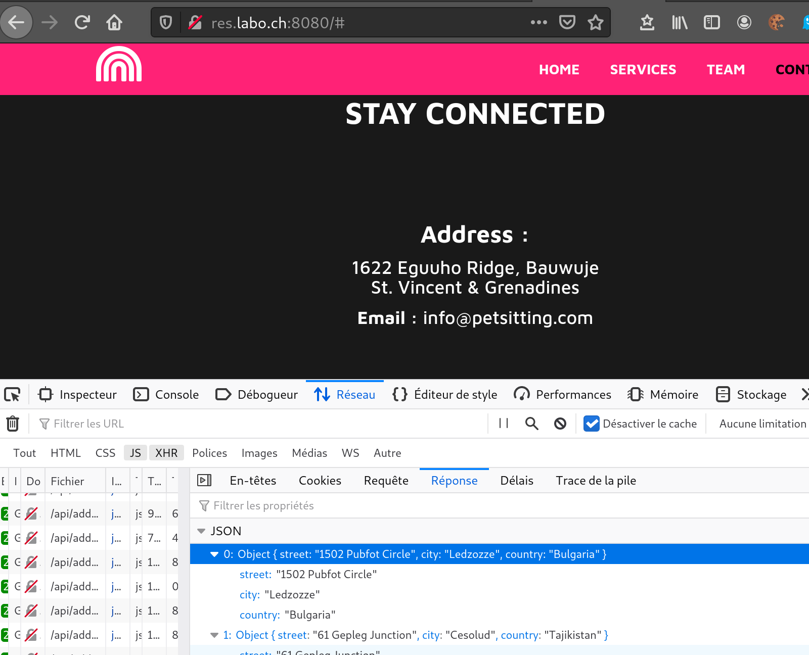
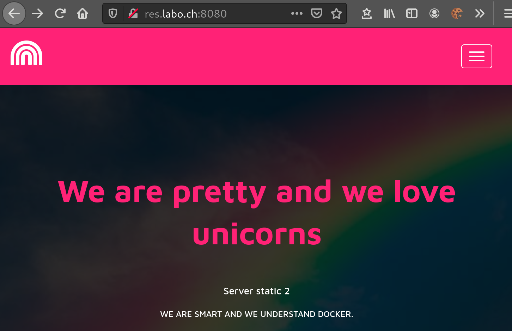
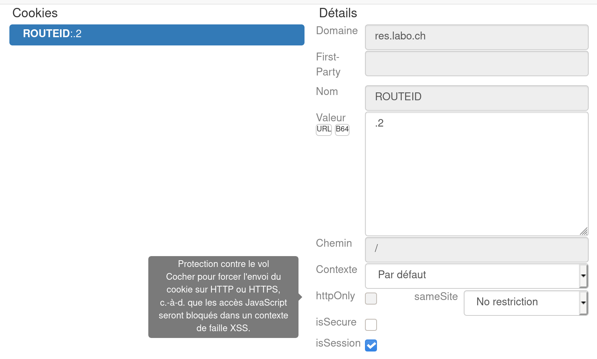
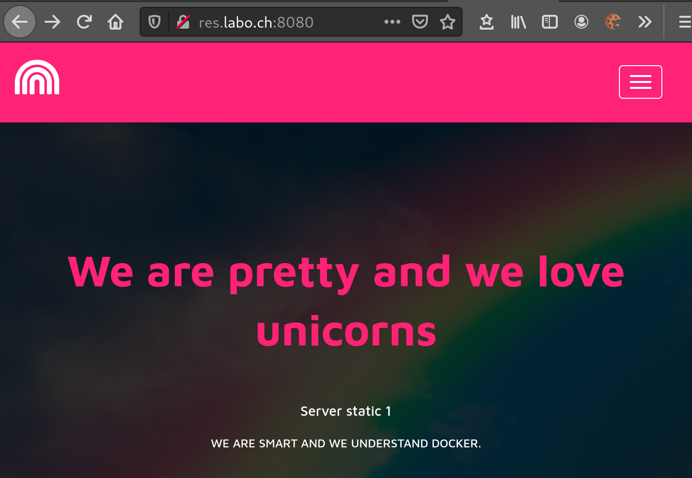
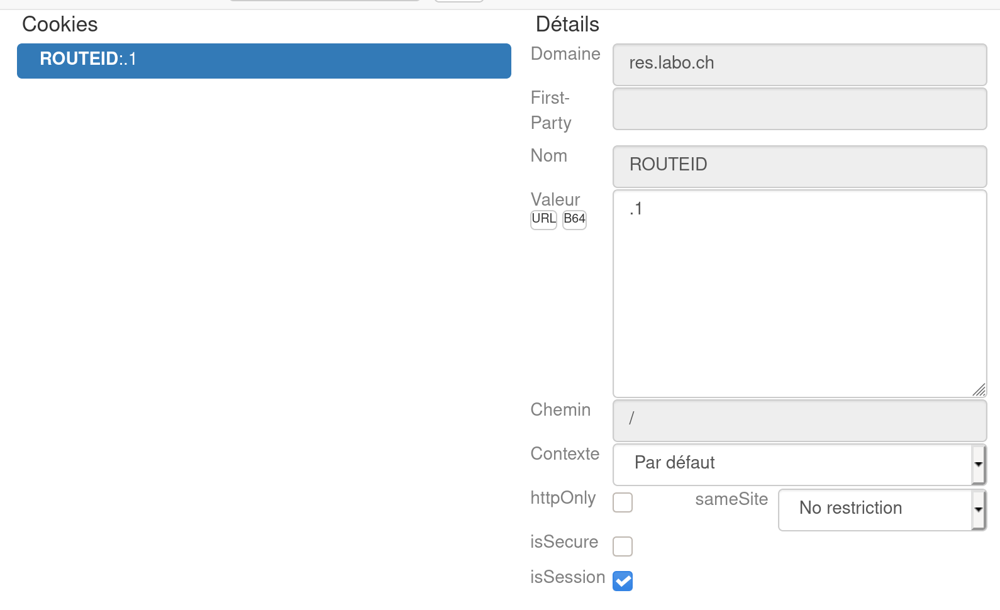
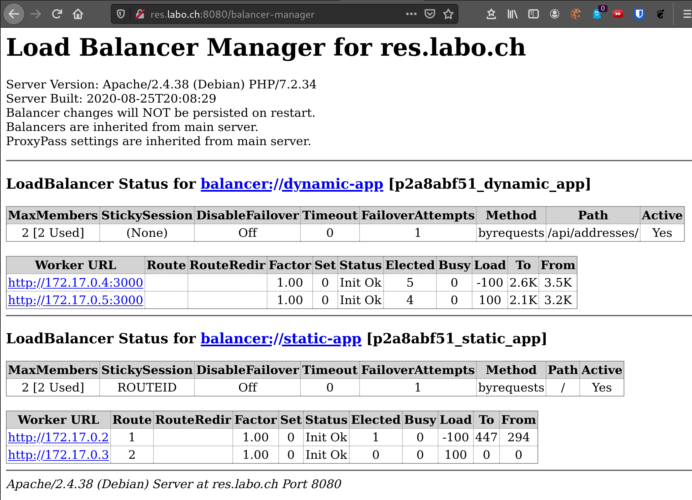
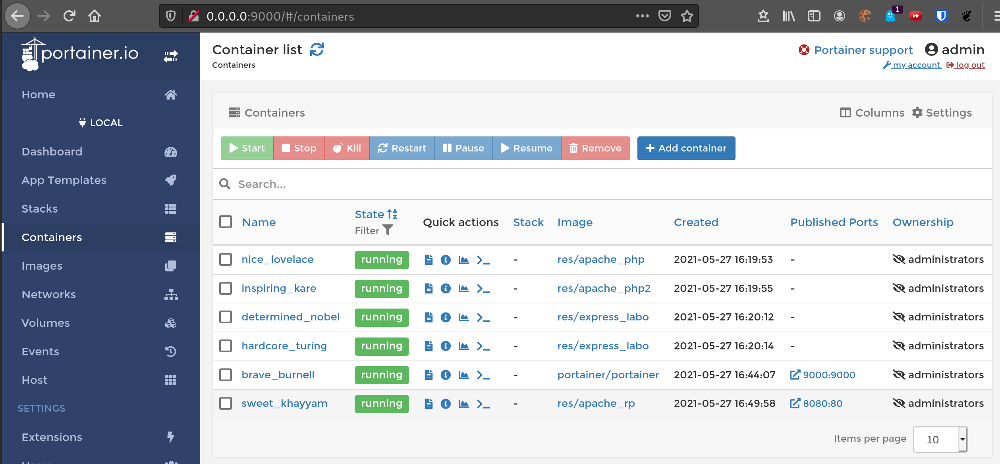

# RES - Laboratoire HTTP Infra

> Auteurs : Gwendoline Dössegger, Cassandre Wojciechowski
>
> Date : 30.05.2021

## Step 1: Serveur static HTTP
Pour cette partie, nous devions dockeriser un serveur HTTP. Pour cela, nous avons utilisé Apache httpd 7.2 avec l'image trouvée sur Docker hub.

Notre template HTML utilise le framework CSS Bootstrap que nous avons personnalisé. [(Source du template)](https://www.themezy.com/free-website-templates/156-pink-free-responsive-bootstrap-template)

### Configuration de l'image du serveur statique HTTP
Dans le Dockerfile, nous avons utilisé la commande `COPY` pour copier les fichiers constituant le site statique dans le répertoire `/var/www/html/` du container. Cet emplacement contient l'ensemble des sites Web affichables avec le serveur Web d'Apache dans le container. 
[Lien vers le Dockerfile](https://github.com/CassandreWoj/Teaching-HEIGVD-RES-2021-Labo-HTTPInfra/blob/master/docker-images/serveur-statique/Dockerfile)

```dockerfile
#Contenu du Dockerfile
FROM php:7.2-apache

LABEL authors="Gwendoline Dossegger <gwendoline.dossegger@heig-vd.ch>, Cassandre Wojciechowski <cassandre.wojciechowski@heig-vd.ch>"

COPY content/ /var/www/html/
```

### Lancement du container
/!\ Pour créer et lancer le container, il faut impérativement se trouver dans le répertoire `serveur-statique`.
```sh
docker build --tag res/site-static .
docker run -d -p 8080:80 res/site-static
```

### Vérification
Pour accéder au site statique, il existe deux moyens :
```shell
#1. On récupère l'adresse IP du container et on se connecte sur le port du container directement
# Pour trouver le nom du container : 
docker ps
# Pour trouver son adresse IP : 
docker inspect <name> | grep -i ipaddr
# Dans le navigateur
> 172.17.0.2:80


#2. On utilise le port mapping directement dans le navigateur de la machine hôte 
# avec l'adresse IP du Docker host et le port de notre machine
> 172.17.0.1:8080
```

Affichage du site statique via le navigateur:


## Step 2: Serveur dynamique HTTP avec express.js
Pour cette étape, nous créons un container Docker contenant une application dynamique, implémentée avec Node.js, dont le rôle est de créer des adresses imaginaires en combinant des rues, des villes et des pays. Ces éléments ont été créé à l'aide du générateur Chancejs.

Pour implémenter notre application, nous avons fait appel à la commande `npm init` pour manager les dépendances liées. 

### Application index.js
Notre application `index.js` permettant de générer aléatoirement des adresses est présentée ci-dessous. Elle en génère au minimum 3 au maximum 15. Les adresses sont constituées d'une rue, d'une ville et d'un pays. L'application écoute sur le port `3000`.
```js
var Chance = require('chance');
var chance = new Chance();

var express = require('express');
var app = express();

app.get('/', function(req, res){
    res.send(generateAddresses());
});

app.listen(3000, function() {
    console.log('Accepting HTTP resquests on port 3000.');
});

function generateAddresses(){
    var noAd = chance.integer({
        min: 3,
        max: 15
    });

    var addr = [];
    for(var i = 0; i < noAd; ++i){
        var street = chance.address();
        var city = chance.city();
        var country = chance.country({full : true});

        addr.push({
            street: street,
            city: city,
            country: country
        });
    };
    console.log(addr);
    return addr;
}
```
### Configuration de l'image du serveur HTTP dynamique
Le Dockerfile créé pour cette étape est le suivant : 
```dockerfile
FROM node:14.17.0

LABEL authors="Gwendoline Dossegger <gwendoline.dossegger@heig-vd.ch>, Cassandre Wojciechowski <cassandre.wojciechowski@heig-vd.ch>"

RUN apt-get update &&\
    apt-get install -y vim

COPY src /opt/app

CMD ["node", "/opt/app/index.js"]
```
Nous copions le répertoire `src` contenant le code de l'application dynamique dans le répertoire `/opt/app` de l'image, car c'est le répertoire racine contenant le code. Nous ajoutons la commande `node /opt/app/index.js` pour que l'application soit lancée automatiquement à chaque démarrage du container.

### Lancement du container
/!\ Pour lancer le container, il faut impérativement se trouver dans le répertoire `express-dynamique`. 
```shell
docker build -t res/site-dynamic .
docker run -p 9090:3000 res/site-dynamic
```

### Vérification 
Pour accéder à l'application dynamique, il existe deux moyens :
```shell
# Méthode 1. On récupère l'adresse IP du container et on se connecte sur le port du container directement
# Pour trouver le nom du container : 
docker ps
# Pour trouver son adresse IP : 
docker inspect <name> | grep -i ipaddr
# Dans le navigateur
> 172.17.0.2:3000
 
# Méthode 2. On utilise le port mapping directement dans le navigateur de la machine hôte 
# avec l'adresse IP du Docker host et le port de notre machine
> 172.17.0.1:9090
```
Nous pouvons aussi passer par le terminal avec la commande : `curl --location --request GET [172.17.0.2:3000](http://172.17.0.2:3000)`

Affichage des données envoyées par l'application dynamique via le navigateur:


## Step 3: Reverse proxy avec apache (configuration statique)
Pour cette étape, nous avons mis en place un reverse proxy avec apache dans un container. Le reverse proxy se trouve dans un container séparé, tout comme l'application dynamique et le site statique. 

### Setup de l'environnement
Dans un premier temps, il faut s'assurer de lancer les containers suivants dans l'ordre car le reverse proxy est actuellement configuré de manière statique. 
```shell
# Run un container du step 1
docker build -t res/site-static ../serveur-statique
docker run -d --name site-static res/site-static
docker inspect site-static | grep -i ipaddress
#> ip : 172.17.0.2

# Run un container du step 2
docker build -t res/site-dynamic ../express-dynamique
docker run -d --name site-dynamic res/site-dynamic
docker inspect express_dynamic | grep -i ipaddress
#> ip : 172.17.0.3
```

### Configuration du VirtualHost
Nous avons modifié les configurations du reverse proxy afin d'indiquer l'adresse sur laquelle l'utilisateur doit être redirigé. 
Ce fichier de configuration se trouve dans le répertoire `conf/sites-available`. 
```shell
<VirtualHost *:80>
	ServerName res.labo.ch
	ProxyPass "/api/addresses/" "http://172.17.0.3:3000/"
	ProxyPassReverse "/api/addresses/" "http://172.17.0.3:3000/"

	ProxyPass "/" "http://172.17.0.2:80/"
	ProxyPassReverse "/" "http://172.17.0.2:80"
</VirtualHost>
```

### Configuration de l'image du reverse proxy

Le Dockerfile associé est le suivant : 
```dockerfile
FROM php:7.2-apache

LABEL authors="Gwendoline Dossegger <gwendoline.dossegger@heig-vd.ch>, Cassandre Wojciechowski <cassandre.wojciechowski@heig-vd.ch>"

COPY conf/ /etc/apache2

RUN apt-get update && apt-get install -y vim
RUN a2enmod proxy proxy_http
RUN a2ensite 000-* 001-*
```
Nous avons indiqué dedans de copier le contenu du répertoire `conf/` dans le répertoire `/etc/apache2` pour que le reverse proxy prenne la configuration mentionnée ci-dessus.
À l'aide de la première commande `RUN`, nous installons vim pour pouvoir modifier des fichiers directement dans le container en exécution. Les deux commandes `RUN` suivantes permettent de configurer le proxy.

### Lancement du container du reverse proxy
Une fois les deux premiers containers lancés (avec le serveur statique et l'application dynamique), nous démarrons le container du reverse proxy.
```shell
# Lancement du proxy
docker build -t res/apache_rp .
docker run -p 8080:80 res/apache_rp
```

### Vérification
> Il faut modifier le fichier `/etc/hosts` pour lui ajouter la correspondance `172.17.0.1     res.labo.ch`.

Nous pourrons ensuite nous connecter sur l'URL `http://res.labo.ch:8080` puis indiquer à quelle ressource nous souhaitons accéder. 
Le site statique se trouve à la racine `/`, tandis que l'application dynamique se trouve sur le chemin `/api/addresses/`. Ces chemins ont été définis dans les configurations expliquées dans la configuration du virtualhost.

Affichage du site statique via le navigateur (`res.labo.ch:8080`):


Affichage du site statique via le navigateur (`res.labo.ch:8080/api/addresses/`):


## Step 4: AJAX requests with JQuery
> Avant toutes manipulations, tous les containers doivent être arrêtés et supprimés avant les manipulations suivantes. Exemple : `docker kill apache_static && docker rm apache_static`

### Création du script de requête AJAX
Pour cette étape, nous avons créé un script js `address.js` reprenant celui de l'étape 2 et l'intégrant à notre site web statique. Le script permet d'intégrer une adresse aléatoire dans notre site (la première du `json` généré), à la rubrique "Adresse" du site. Il a été placé dans le répertoire `serveur-statique/content/assets/js`. 

```js
$(function(){
    console.log("LOADING ADDRESSES");

    function loadAddresses(){
        $.getJSON("/api/addresses/", function(addresses){
            console.log(addresses);
            var message = "No address";
            if(addresses.length > 3){
                message = addresses[0].street + ', ' + addresses[0].city + '<br>' + addresses[0].country;
            }
            $(".address").html(message);
        });

    };
    loadAddresses();
    setInterval(loadAddresses, 2000);
});
```
### Modification du site statique
Une fois le script créé, nous avons ajouté une balise `<script>` dans le code html du site statique pour indiquer l'emplacement du script. Nous avons également ajouté un nom à la classe html contenant la rubrique de l'adresse afin de pouvoir la référencer dans le script.
```html
<h4 class="address">Dream Road, 14, DreamLand</h4>
[...]
<!-- Script load address -->
<script src="assets/js/address.js"></script>
```

### Setup de l'environnement
Pour effectuer ces commandes, il faut se placer dans le répertoire `docker-images`.
```shell
# Run un container du step 1 (site statique)
docker build -t res/site-static ../serveur-statique
docker run -d --name site-static res/site-static
 
# Run un container du step 2 (application dynamique)
docker run -d --name site-dynamic res/site-dynamic

# Run le container du reverse proxy
docker build -t res/apache_rp .
docker run -p 8080:80 res/apache_rp
```

### Vérification
Nous avons modifié les fichiers en local (`index.html` et `address.js`), puis nous les avons récupéré en faisant le `build` de l'image du site statique pour créer le container.

Une fois tous les containers lancés, nous avons pu constaté que le système fonctionnait correctement en nous connectant sur l'URL `res.labo.ch:8080` via un navigateur et en observant les adresses aléatoires défiler sous la rubrique "Adresse" de notre site web statique.


### Pourquoi la démo ne fonctionnerait pas sans reverse proxy ?
La démonstration ne fonctionnerait pas sans le reverse proxy, car le site web est sur un serveur apache dans un container et le script js est situé dans un autre container. 
Le reverse proxy va envoyer les requêtes vers le bon serveur: celui contenant le script. Sans le reverse proxy, on ne pourrait pas atteindre le script.

## Step 5: Dynamic reverse proxy configuration
> Pour cette étape, il faut tuer et supprimer le container reverse-proxy créé à l'étape 4.

### Configuration du reverse proxy dynamique
Pour cette étape, nous avons récupéré le fichier `apache2-foreground` depuis une image Apache 7.2. Nous avons ajouté l'affichage des variables `STATIC_APP` et `DYNAMIC_APP` en plus.
```shell
#!/bin/bash
set -e

#Add RES config
echo "Setup pour labo RES"
echo "Static  App URL :  $STATIC_APP "
echo "Dynamic App URL :  $DYNAMIC_APP "

php /var/apache2/templates/config-template.php > /etc/apache2/sites-available/001-reverse-proxy.conf

# Note: we don't just use "apache2ctl" here because it itself is just a shell-script wrapper around apache2 which provides extra functionality like "apache2ctl start" for launching apache2 in the background.
# (also, when run as "apache2ctl <apache args>", it does not use "exec", which leaves an undesirable resident shell process)
: "${APACHE_CONFDIR:=/etc/apache2}"
: "${APACHE_ENVVARS:=$APACHE_CONFDIR/envvars}"
if test -f "$APACHE_ENVVARS"; then
	. "$APACHE_ENVVARS"
fi

# Apache gets grumpy about PID files pre-existing
: "${APACHE_RUN_DIR:=/var/run/apache2}"
: "${APACHE_PID_FILE:=$APACHE_RUN_DIR/apache2.pid}"
rm -f "$APACHE_PID_FILE"

# create missing directories
# (especially APACHE_RUN_DIR, APACHE_LOCK_DIR, and APACHE_LOG_DIR)
for e in "${!APACHE_@}"; do
	if [[ "$e" == *_DIR ]] && [[ "${!e}" == /* ]]; then
		# handle "/var/lock" being a symlink to "/run/lock", but "/run/lock" not existing beforehand, so "/var/lock/something" fails to mkdir
		#   mkdir: cannot create directory '/var/lock': File exists
		dir="${!e}"
		while [ "$dir" != "$(dirname "$dir")" ]; do
			dir="$(dirname "$dir")"
			if [ -d "$dir" ]; then
				break
			fi
			absDir="$(readlink -f "$dir" 2>/dev/null || :)"
			if [ -n "$absDir" ]; then
				mkdir -p "$absDir"
			fi
		done

		mkdir -p "${!e}"
	fi
done

exec apache2 -DFOREGROUND "$@"
```

Grâce au code contenu dans le fichier `apache2-foreground`, nous pouvons récupérer les variables d'environnement passées au lancement du container (avec -e), construire le `VirtualHost` à partir des adresses IP obtenues et copier le résultat du script dans le fichier `001-reverse-proxy.conf`. Le contenu ci-dessous se trouve dans le fichier à l'emplacement : `reverse-proxy/templates/config-template.php`.
```php
<?php
$ip_static = getenv('STATIC_APP');
$ip_dynamic = getenv('DYNAMIC_APP');
?>

<VirtualHost *:80>
	ServerName res.labo.ch
	ProxyPass '/api/addresses/' 'http://<?php echo "$ip_dynamic"?>/'
	ProxyPassReverse '/api/addresses/' 'http://<?php echo "$ip_dynamic"?>/'

	ProxyPass '/' 'http://<?php echo "$ip_static"?>/'
	ProxyPassReverse '/' 'http://<?php echo "$ip_static"?>'
</VirtualHost>
```

Dans le Dockerfile, nous copions les configurations et le script php dans l'image:
```dockerfile
FROM php:7.2-apache

LABEL authors="Gwendoline Dossegger <gwendoline.dossegger@heig-vd.ch>, Cassandre Wojciechowski <cassandre.wojciechowski@heig-vd.ch>"
RUN apt-get update && apt-get install -y vim

COPY apache2-foreground /usr/local/bin/
COPY templates /var/apache2/templates
COPY conf/ /etc/apache2

RUN a2enmod proxy proxy_http
RUN a2ensite 000-* 001-*
```

### Setup de l'environnement
Ainsi, nous pouvons donner les adresses de containers contenant les applications statique (site web) et dynamique (JSON contenant des adresses aléatoires).
```shell
docker run -p 8080:80 -e STATIC_APP=172.17.0.5:80 -e DYNAMIC_APP=172.17.0.4:3000 res/apache_rp
```

### Vérification
Pour vérifier le bon fonctionnement de notre système, nous avons lancé le container du reverse proxy avec des adresses IP différentes et l'affichage reste le même que précédemment, signe que tout fonctionne correctememt. Nous avons constaté que les adresses IP récupérées dynamiquement dans le fichier `VirtualHost` sont effectivement celles passées avec l'option -e dans la commande.

## Bonus: Load balancing: multiple server nodes

### Configuration préalable du setup d'environnement
Nous avons dupliqué le répertoire `serveur-statique` afin de générer deux images docker différentes. Pour chacun des sites statiques nous avons modifié le fichier `index.html`pour avoir une indication de quel container est utilisé. 

On se retrouve donc avec un dossier `serveur-statique` et `serveur-statique2`. 
> Nous aurions pu utiliser la même image et modifier directement via le terminal le fichier `index.html`. Cependant, nous voulions pouvoir relancer des containers à volonté et rapidement.

### Configurations pour supporter le load balancing
Nous avons modifié le Dockerfile du reverse proxy pour ajouter une valeur à la ligne `RUN a2enmod`:

```dockerfile
FROM php:7.2-apache

LABEL authors="Gwendoline Dossegger <gwendoline.dossegger@heig-vd.ch>, Cassandre Wojciechowski <cassandre.wojciechowski@heig-vd.ch>"
RUN apt-get update && apt-get install -y vim

COPY apache2-foreground /usr/local/bin/
COPY templates /var/apache2/templates
COPY conf/ /etc/apache2

RUN a2enmod proxy proxy_http proxy_balancer
RUN a2ensite 000-* 001-*
```

Nous avons également modifié le fichier `config-template.php` pour ajouter les balises `Proxy Balancer`: 
```php
<?php
$ip_static1 = getenv('STATIC_APP1');
$ip_static2 = getenv('STATIC_APP2');
$ip_dynamic1 = getenv('DYNAMIC_APP1');
$ip_dynamic2 = getenv('DYNAMIC_APP2');
?>

<VirtualHost *:80>
	ServerName res.labo.ch

    <Proxy balancer://dynamic-app>
        BalancerMember 'http://<?php echo "$ip_dynamic1"?>'
        BalancerMember 'http://<?php echo "$ip_dynamic2"?>'
    </Proxy>

    <Proxy balancer://static-app>
        BalancerMember 'http://<?php echo "$ip_static1"?>'
        BalancerMember 'http://<?php echo "$ip_static2"?>'
    </Proxy>

    ProxyPass '/api/addresses/' 'balancer://dynamic-app/'
    ProxyPassReverse '/api/addresses/' 'balancer://dynamic-app/'

	ProxyPass '/' 'balancer://static-app/'
	ProxyPassReverse '/' 'balancer://static-app/'

</VirtualHost>
```

### Vérification
Nous avons démarré plusieurs containers pour procéder aux tests (2x avec le site web (statique) et 2x avec l'application (dynamique)) :
```shell
# Depuis le répertoire docker-images
docker build -t res/site-static1 serveur-statique
docker build -t res/site-static2 serveur-statique2
docker build -t res/site-dynamic express-dynamique
docker build -t res/apache_rp reverse-proxy

docker run -d --name site-static1 res/site-static1
docker run -d --name site-static2 res/site-static2
docker run -d --name site-dynamic1 res/site-dynamic
docker run -d --name site-dynamic2 res/site-dynamic
export STATIC_APP1=$(docker inspect -f '{{.NetworkSettings.IPAddress }}' site-static1)":80"
export STATIC_APP2=$(docker inspect -f '{{.NetworkSettings.IPAddress }}' site-static2)":80"
export DYNAMIC_APP1=$(docker inspect -f '{{.NetworkSettings.IPAddress }}' site-dynamic1)":3000"
export DYNAMIC_APP2=$(docker inspect -f '{{.NetworkSettings.IPAddress }}' site-dynamic2)":3000"

docker run -p 8080:80 -e STATIC_APP1=$STATIC_APP1 -e STATIC_APP2=$STATIC_APP2 -e DYNAMIC_APP1=$DYNAMIC_APP1 -e DYNAMIC_APP2=$DYNAMIC_APP2 res/apache_rp
```

Comme on peut le constater dans les images ci-dessous, lorsqu'on est sur le "serveur 2" (container site-static2) la valeur "Serveur statique 2" est affichée. Sinon on aura la valeur "Serveur statique 1".


## Bonus: Load balancing: round-robin vs sticky sessions
> Pour cette partie, nous avons gardé les 4 containers (statiques et dynamiques) mais nous avons arrêté le container reverse-proxy.
### Configurations des sticky sessions
Nous avons modifié la ligne `RUN a2enmod` du Dockerfile du reverse proxy pour y ajouter des valeurs supplémentaires.

```dockerfile
FROM php:7.2-apache

LABEL authors="Gwendoline Dossegger <gwendoline.dossegger@heig-vd.ch>, Cassandre Wojciechowski <cassandre.wojciechowski@heig-vd.ch>"
RUN apt-get update && apt-get install -y vim

COPY apache2-foreground /usr/local/bin/
COPY templates /var/apache2/templates
COPY conf/ /etc/apache2

RUN a2enmod proxy proxy_http proxy_balancer lbmethod_byrequests headers
RUN a2ensite 000-* 001-*
```

Nous avons modifié le fichier `config-template.php` pour ajouter la ligne permettant de gérer des cookies:
```php
<?php
$ip_static1 = getenv('STATIC_APP1');
$ip_static2 = getenv('STATIC_APP2');
$ip_dynamic1 = getenv('DYNAMIC_APP1');
$ip_dynamic2 = getenv('DYNAMIC_APP2');
?>

<VirtualHost *:80>
	ServerName res.labo.ch

    # Set cookie containing the route
    Header add Set-Cookie "ROUTEID=.%{BALANCER_WORKER_ROUTE}e; path=/" env=BALANCER_ROUTE_CHANGED

    <Proxy balancer://dynamic-app>
        BalancerMember 'http://<?php echo "$ip_dynamic1"?>'
        BalancerMember 'http://<?php echo "$ip_dynamic2"?>'
    </Proxy>

    <Proxy balancer://static-app>
        BalancerMember 'http://<?php echo "$ip_static1"?>' route=1
        BalancerMember 'http://<?php echo "$ip_static2"?>' route=2
        ProxySet lbmethod=byrequests
        ProxySet stickysession=ROUTEID
    </Proxy>
    
    ProxyPass '/api/addresses/' 'balancer://dynamic-app/'
    ProxyPassReverse '/api/addresses/' 'balancer://dynamic-app/'

	ProxyPass '/' 'balancer://static-app/'
	ProxyPassReverse '/' 'balancer://static-app/'

</VirtualHost>
```

### Vérification
```shell
docker build -t res/apache_rp reverse-proxy
docker run -p 8080:80 -e STATIC_APP1=$STATIC_APP1 -e STATIC_APP2=$STATIC_APP2 -e DYNAMIC_APP1=$DYNAMIC_APP1 -e DYNAMIC_APP2=$DYNAMIC_APP2 res/apache_rp
```
Nous avons reconstruit et rédamarré le container du reverse proxy - load balancer pour que les modifications soient prises en compte, puis pour vérifier le bon fonctionnement de nos configurations, nous avons utilisé deux navigateurs différents pour nous connecter sur le site et nous avons rechargé les pages plusieurs fois.
Nous avons ainsi pu constater que les serveurs restent les mêmes pour une session donnée. Sur les images, on peut constater que le Cookie est bien set et que l'affichage est en conséquence de l'ID (selon les routes). 









## Bonus: Dynamic cluster management
Nous avons modifié le fichier `config-template.php` pour lui ajouter les balises `<Location>`:

```php
<?php
$ip_static1 = getenv('STATIC_APP1');
$ip_static2 = getenv('STATIC_APP2');
$ip_dynamic1 = getenv('DYNAMIC_APP1');
$ip_dynamic2 = getenv('DYNAMIC_APP2');
?>

<VirtualHost *:80>
	ServerName res.labo.ch

    # Set cookie containing the route
    Header add Set-Cookie "ROUTEID=.%{BALANCER_WORKER_ROUTE}e; path=/" env=BALANCER_ROUTE_CHANGED

    <Proxy balancer://dynamic-app>
        BalancerMember 'http://<?php echo "$ip_dynamic1"?>'
        BalancerMember 'http://<?php echo "$ip_dynamic2"?>'
    </Proxy>

    <Proxy balancer://static-app>
        BalancerMember 'http://<?php echo "$ip_static1"?>' route=1
        BalancerMember 'http://<?php echo "$ip_static2"?>' route=2
        ProxySet lbmethod=byrequests
        ProxySet stickysession=ROUTEID
    </Proxy>

    <Location "/balancer-manager">
        SetHandler balancer-manager
    </Location>

    ProxyPass '/balancer-manager' !

    ProxyPass '/api/addresses/' 'balancer://dynamic-app/'
    ProxyPassReverse '/api/addresses/' 'balancer://dynamic-app/'

	ProxyPass '/' 'balancer://static-app/'
	ProxyPassReverse '/' 'balancer://static-app/'

</VirtualHost>
```

### Vérification
Nous pouvons dès maintenant accéder au `Load Balancer Manager` via l'URL `res.labo.ch:8080/balancer-manager`. On peut constater que les données sont mises à jour pour le `balancer://dynamic-app` lorsqu'un utilisateur est sur le site web statique. 




## Bonus: Management UI
Nous avons discuté et testé plusieurs outils, nous avons finalement choisi `Portainer` pour sa facilité d'installation et d'utilisation.
Nous avons considéré le projet `Shipyard` mais il n'est malheureusement plus maintenu. Nous avons également essayé `Docker Compose UI`, qui n'est pas aussi simple d'utilisation, car il y a pas mal de configuration à faire dessus.
Nous aurions voulu tester `Kitematic`, mais travaillant sur un système Linux, ce n'était pas possible de l'utiliser.

Pour utiliser `Portainer`, il suffit de lancer la commande : 
````shell
docker run -d -p 9000:9000 -v /var/run/docker.sock:/var/run/docker.sock portainer/portainer
````

Puis de se connecter avec le navigateur sur l'URL `0.0.0.0:9000` pour arriver sur l'interface Web.



Sur cette interface, tous les containers et les images Docker sont recensés, qu'ils soient actifs ou arrêtés. Il est possible de démarrer des containers, des les arrêter, etc. Des informations sur chaque container sont disponibles sur l'interface.
