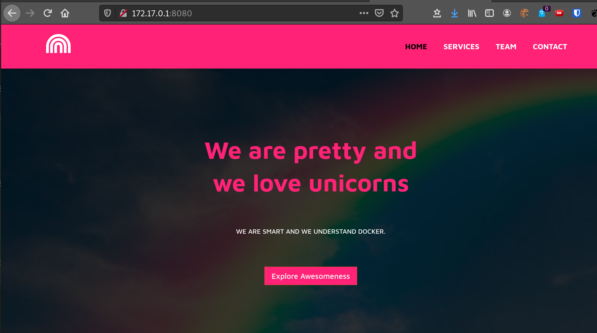
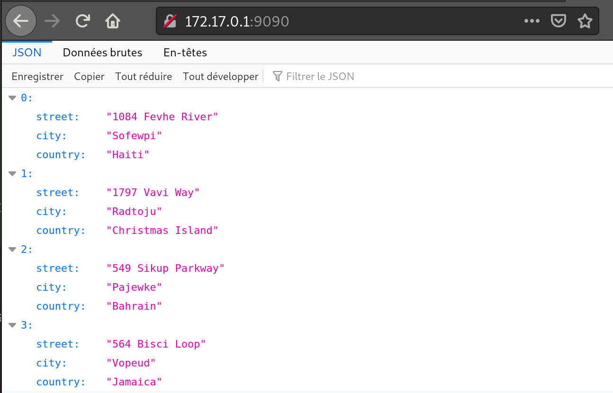
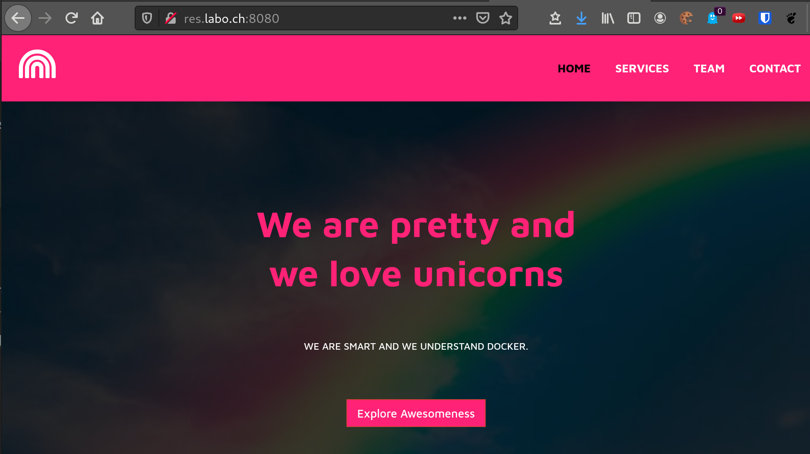
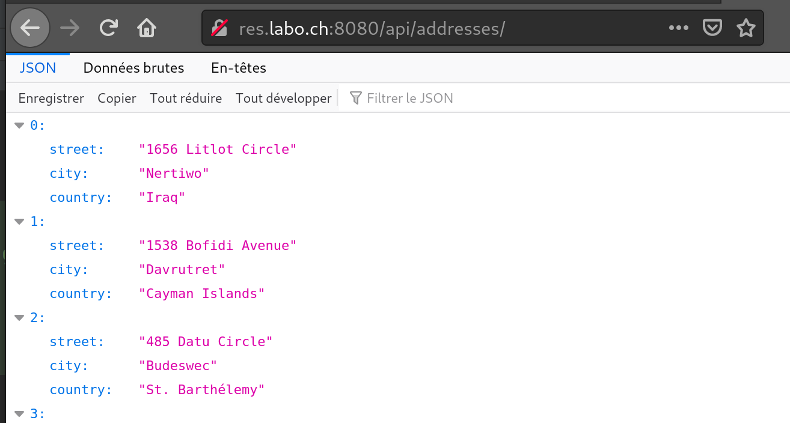
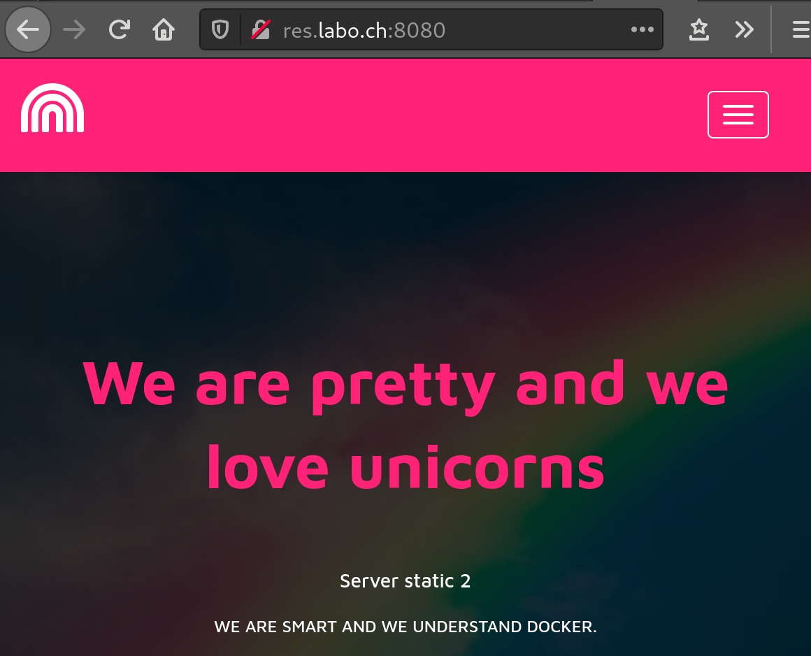
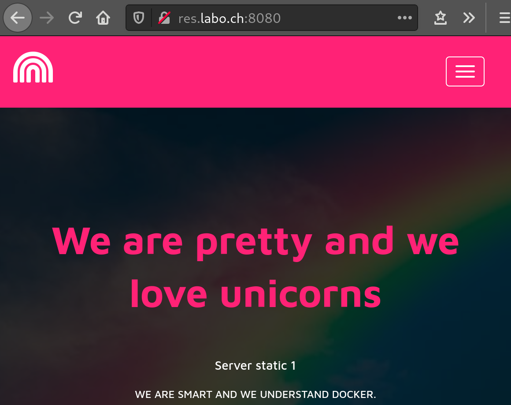

# RES - Laboratoire HTTP Infra

> Auteurs : Gwendoline Dössegger, Cassandre Wojciechowski
>
> Date : 30.05.2021

## Step 1 Serveur static HTTP
Pour cette partie, nous devions dockeriser un serveur HTTP. Pour cela, nous avons utilisé Apache httpd 7.2 avec l'image trouvée sur Docker hub.

Notre template HTML utilise le framework CSS Bootstrap que nous avons personnalisé : [template source](https://www.themezy.com/free-website-templates/156-pink-free-responsive-bootstrap-template)

Dans le Dockerfile, nous avons utilisé la commande `COPY` pour copier les fichiers constituant le site statique dans `/var/www/html/` du container. Cet emplacement est la racine du serveur Web d'Apache dans le container. 
[Lien vers le Dockerfile](https://github.com/CassandreWoj/Teaching-HEIGVD-RES-2021-Labo-HTTPInfra/blob/master/docker-images/serveur-statique/Dockerfile)
```dockerfile
#Contenu du Dockerfile
FROM php:7.2-apache
LABEL authors="Gwendoline Dossegger <gwendoline.dossegger@heig-vd.ch>, Cassandre Wojciechowski <cassandre.wojciechowski@heig-vd.ch>"
COPY content/ /var/www/html/
```


/!\ Pour lancer le container, il faut impérativement se trouver dans le répertoire apache-php-image.
```sh
#Via les scripts :
./build-image.sh
./run-image.sh

#Via les commandes docker directement :
docker build --tag res/apache_php .
docker run -d -p 8080:80 res/apache_php 
```

Pour accéder au site statique, il existe deux moyens :
```shell
#1. On récupère l'adresse IP du container et on se connecte sur le port du container directement
# Pour trouver le nom du container : 
docker ps
# Pour trouver son adresse IP : 
docker inspect <name> | grep -i ipaddr
# Dans le navigateur
> 172.17.0.2:80


#2. On utilise le port mapping directement dans le navigateur de la machine hôte 
# avec l'adresse IP du Docker host et le port de notre machine
> 172.17.0.1:8080
```

Affichage du site statique via le navigateur



## Step 2 Serveur dynamique HTTP avec express.js

Express.js est une infrastructure d'applications Web basée sur Node.js. 
Pour cette étape, nous créons un container Docker contenant une application dynamique, programmée avec Node.js, dont le rôle est de créer des adresses imaginaires en combinant des rues, des villes et des pays. Ces éléments ont été créé à l'aide du générateur Chancejs.

/!\ Pour lancer le container, il faut impérativement se trouver dans le répertoire express-dynamique. 
```shell
#Via les scripts :
./build-image.sh
./run-image.sh

#Via les commandes docker : 
docker build -t res/express_labo .
docker run -p 9090:3000 res/express_labo
```

Pour accéder à l'application dynamique, il existe deux moyens :
```shell
#1. On récupère l'adresse IP du container et on se connecte sur le port du container directement

# Pour trouver le nom du container : 
docker ps
# Pour trouver son adresse IP : 
docker inspect <name> | grep -i ipaddr
# Dans le navigateur
> 172.17.0.2:3000

 
#2. On utilise le port mapping directement dans le navigateur de la machine hôte 
# avec l'adresse IP du Docker host et le port de notre machine
> 172.17.0.1:9090
```
Nous pouvons aussi passer par le terminal avec la commande : `curl --location --request GET [172.17.0.2:3000](http://172.17.0.2:3000)`

Affichage du site statique via le navigateur


## Step 3 Reverse proxy avec apache (configuration statique)

Pour cette étape, nous avons mis en place un reverse proxy avec apache dans un container. Le reverse proxy se trouve dans un container séparé, tout comme l'application dynamique et le site statique. 

Dans un premier temps, il faut s'assurer de lancer les containers suivants dans l'ordre car le reverse proxy est actuellement configuré de manière statique. 
```shell
# Run un container du step 1
docker build -t res/apache_php ../serveur-statique
docker run -d --name apache_static res/apache_php
docker inspect apache_static | grep -i ipaddress
#> ip : 172.17.0.2

# Run un container du step 2
docker build -t res/express_labo ../express-dynamique
docker run -d --name express_dynamic res/express_labo
docker inspect express_dynamic | grep -i ipaddress
#> ip : 172.17.0.3
```

Nous avons modifié les configurations du reverse proxy afin d'indiquer l'adresse sur laquelle l'utilisateur est redirigé. 
Ce fichier de configuration se trouve dans `conf/sites-available`. 
```shell
<VirtualHost *:80>
	ServerName res.labo.ch
	ProxyPass "/api/addresses/" "http://172.17.0.3:3000/"
	ProxyPassReverse "/api/addresses/" "http://172.17.0.3:3000/"

	ProxyPass "/" "http://172.17.0.2:80/"
	ProxyPassReverse "/" "http://172.17.0.2:80"
</VirtualHost>
```

Le Dockerfile associé est le suivant : 
```dockerfile
FROM php:7.2-apache
LABEL authors="Gwendoline Dossegger <gwendoline.dossegger@heig-vd.ch>, Cassandre Wojciechowski <cassandre.wojciechowski@heig-vd.ch>"
COPY conf/ /etc/apache2
RUN apt-get update && apt-get install -y vim
RUN a2enmod proxy proxy_http
RUN a2ensite 000-* 001-*
```
Nous avons indiqué dedans de copier le contenu du répertoire `conf/` dans le répertoire `/etc/apache2` pour que le reverse proxy prenne la configuration mentionnée ci-dessus.
À l'aide de la première commande `RUN`, nous installons vim pour pouvoir modifier des fichiers directement dans le container en exécution.
Les deux commandes `RUN` suivantes permettent de configurer le proxy. 

Une fois les deux premiers containers lancés (avec le serveur statique et l'application dynamique), nous démarrons le container du reverse proxy.
```shell
# Lancement du proxy
docker build -t res/apache_rp .
docker run -p 8080:80 res/apache_rp
```

Il faut modifier le fichier `/etc/hosts` pour lui ajouter la correspondance `172.17.0.1     res.labo.ch`. 
Nous pourrons ensuite nous connecter sur l'adresse `http://172.17.0.1:8080` puis indiquer quelle ressource nous souhaitons accéder. 
Le site statique se trouve à la racine, tandis que l'application se trouve sur le chemin `/api/addresses/`. Ces chemins ont été définis dans les configurations expliquées ci-dessus.

Affichage du site statique via le navigateur (res.labo.ch:8080)


Affichage du site statique via le navigateur (res.labo.ch:8080/api/addresses/)



## Step 4 AJAX requests with JQuery
> Tous les containers doivent être tué avant les manipulations suivantes exemple : `docker kill apache_static && docker rm apache_static`

Pour cette étape, nous avons créé un script js `address.js` reprenant celui de l'étape 2 et l'intégrant à notre site web statique. 

Nous avons commencé par modifier les Dockerfile précédemment créés pour qu'ils installent `vim` dès le lancement des containers. Nous avons reconstruit les images et run les trois containers. 
Le script js créé permet d'intégrer une adresse aléatoire dans notre site (la première du `json`), à la rubrique "Adresse".

```js
$(function(){
    console.log("lOADING ADDRESSES");

    function loadAddresses(){
        $.getJSON("/api/addresses/", function(addresses){
            console.log(addresses);
            var message = "No address";
            if(addresses.length > 3){
                message = addresses[0].street + ', ' + addresses[0].city + '<br>' + addresses[0].country;
            }
            $(".address").html(message);
        });

    };
    loadAddresses();
    setInterval(loadAddresses, 2000);
});
```

Une fois le script créé directement dans le terminal du container, nous avons testé le bon fonctionnement en ajoutant une balise `script` dans le code html du site statique pour indiquer l'emplacement du script.
Nous avons également ajouté un nom à la classe html contenant la rubrique de l'adresse afin de pouvoir la référencer dans le script.
```html
<h4 class="address">Dream Road, 14, DreamLand</h4>
...
<!-- Script load address -->
<script src="assets/js/address.js"></script>
```

Dès lors que nous avons constaté que tout fonctionnait correctement, nous avons modifié les fichiers en local (index.html et address.js), puis nous les récupérons en faisant le `build` pour créer le container.

Nous avons vérifié que le tout fonctionnait toujours en arrêtant le container, en le supprimant, puis en relançant un `build` et un `run`.

La démonstration ne fonctionnerait pas sans le reverse proxy, car le site web est sur un serveur apache dans un container et le script js est situé dans un autre container. 
Le reverse proxy va envoyer les requêtes vers le bon serveur : celui contenant le script. Sans le reverse proxy, on ne pourrait pas atteindre le script.

## Step 5 Dynamic reverse proxy configuration
Pour cette étape, nous avons récupéré le fichier `apache2-foreground` depuis l'image Apache 7.2. Nous avons ajouté l'affichage des variables `STATIC_APP` et `DYNAMIC_APP` en plus. 
Nous avons également ajouté la ligne suivante : 
```shell
php /var/apache2/templates/config-template.php > /etc/apache2/sites-available/001-reverse-proxy.conf
```

Celle-ci va exécuter le script php (ci-dessous) pour récupérer les variables d'environnement passées au lancement du container (avec -e), construire le `VirtualHost` à partir des adresses IP obtenues
et copier le résultat du script dans le fichier `001-reverse-proxy.conf`.
```php
<?php
$ip_static = getenv('STATIC_APP');
$ip_dynamic = getenv('DYNAMIC_APP');
?>

<VirtualHost *:80>
	ServerName res.labo.ch
	ProxyPass '/api/addresses/' 'http://<?php echo "$ip_dynamic"?>/'
	ProxyPassReverse '/api/addresses/' 'http://<?php echo "$ip_dynamic"?>/'

	ProxyPass '/' 'http://<?php echo "$ip_static"?>/'
	ProxyPassReverse '/' 'http://<?php echo "$ip_static"?>'
</VirtualHost>
```

Dans le Dockerfile, nous copions les configurations et le script php dans l'image :
```dockerfile
FROM php:7.2-apache

LABEL authors="Gwendoline Dossegger <gwendoline.dossegger@heig-vd.ch>, Cassandre Wojciechowski <cassandre.wojciechowski@heig-vd.ch>"
RUN apt-get update && apt-get install -y vim

COPY apache2-foreground /usr/local/bin/
COPY templates /var/apache2/templates
COPY conf/ /etc/apache2

RUN a2enmod proxy proxy_http
RUN a2ensite 000-* 001-*
```

Ainsi, nous pouvons donner les adresses de containers contenant les applications statique (site web) et dynamique (JSON avec les adresses aléatoires).
```shell
docker run -p 8080:80 -e STATIC_APP=172.17.0.5:80 -e DYNAMIC_APP=172.17.0.4:3000 res/apache_rp
```

## Bonus Load balancing: multiple server nodes

1. Modification du Dockerfile du reverse proxy pour ajouter : `RUN a2enmod proxy proxy_http lbmethod_byrequests proxy_balancer`
2. Modification du config-template.php pour ajouter les balises `Proxy Balancer`.
3. Lancement de plusieurs containers (pour tester : 2x avec le site web (statique) et 2x avec l'application (dynamique))
    -> `docker inspect <nom du container>`
    -> récupération des adresses IP
    -> commande `docker run` avec les 4 adresses IP observées précédemment passées comme variables d'environnement avec -e.
   
```php
<?php
$ip_static1 = getenv('STATIC_APP1');
$ip_static2 = getenv('STATIC_APP2');
$ip_dynamic1 = getenv('DYNAMIC_APP1');
$ip_dynamic2 = getenv('DYNAMIC_APP2');
?>

<VirtualHost *:80>
	ServerName res.labo.ch

    <Proxy balancer://dynamic-app>
        BalancerMember 'http://<?php echo "$ip_dynamic1"?>'
        BalancerMember 'http://<?php echo "$ip_dynamic2"?>'
    </Proxy>

    <Proxy balancer://static-app>
        BalancerMember 'http://<?php echo "$ip_static1"?>'
        BalancerMember 'http://<?php echo "$ip_static2"?>'
    </Proxy>

    ProxyPass '/api/addresses/' 'balancer://dynamic-app/'
    ProxyPassReverse '/api/addresses/' 'balancer://dynamic-app/'

	ProxyPass '/' 'balancer://static-app/'
	ProxyPassReverse '/' 'balancer://static-app/'

</VirtualHost>
```


```shell
docker build -t res/apache_php serveur_statique/
docker build -t res/apache_php2 serveur_statique2/
docker build -t res/express_labo express_dynamique/

docker run -d res/apache_php
docker run -d res/apache_php2
docker run -d res/express_labo

docker ps
docker inspect <nom des containers> | grep -i ipa

docker run -p 8080:80 -e STATIC_APP1=172.17.0.2:80 -e STATIC_APP2=172.17.0.3:80 -e DYNAMIC_APP1=172.17.0.4:3000 -e DYNAMIC_APP2=172.17.0.5:3000 res/apache_rp

```

TODO VERIFICATION
> docker run -p 8080:80 -e STATIC_APP1=172.17.0.2:80 -e STATIC_APP2=172.17.0.3:80 -e DYNAMIC_APP1=172.17.0.4:3000 -e DYNAMIC_APP2=172.17.0.5:3000 res/apache_rp


Afin de vérifier le bon fonctionnement de notre load balancing, nous avons créé une autre image de res/apache_php avec le code source du site modifié. Comme on peut le constater dans les images ci-dessous, lorsqu'on est sur le "serveur 2" (container basé sur la seconde image) la valeur "Serveur static 2" est affichée. Sinon on aura la valeur "Serveur static 1".

